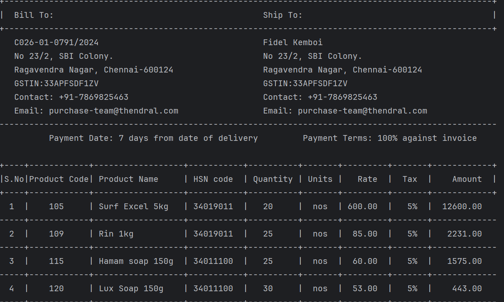
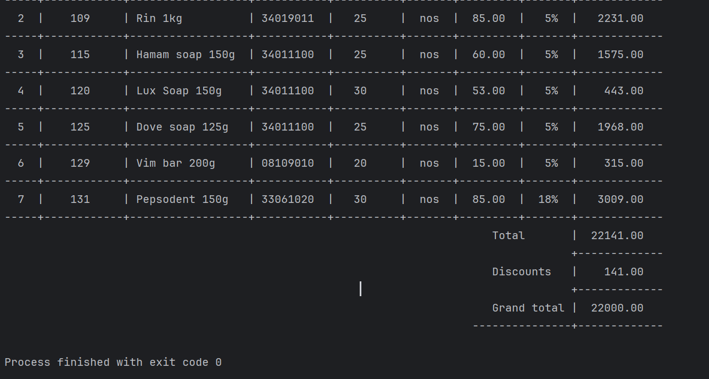
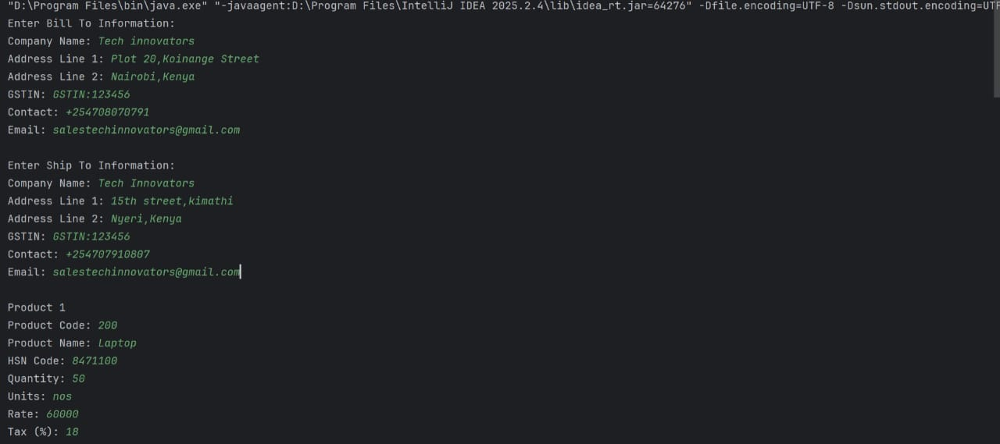
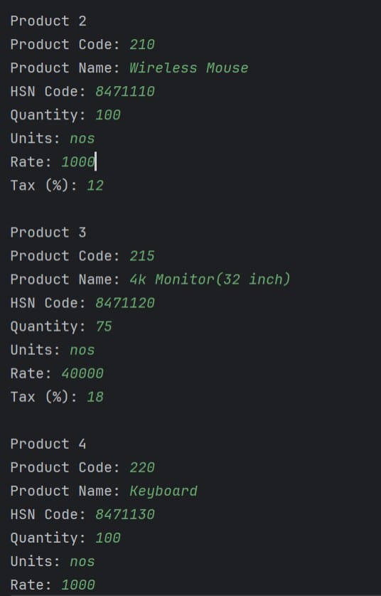
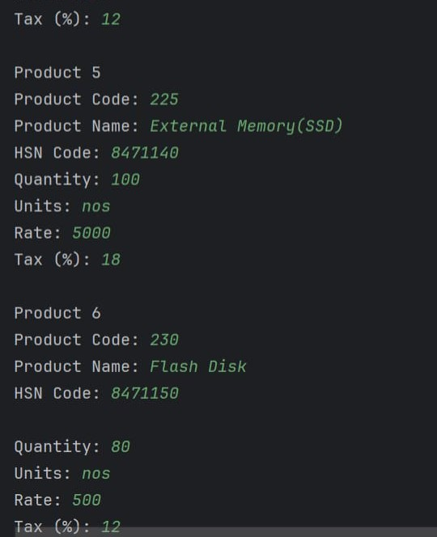
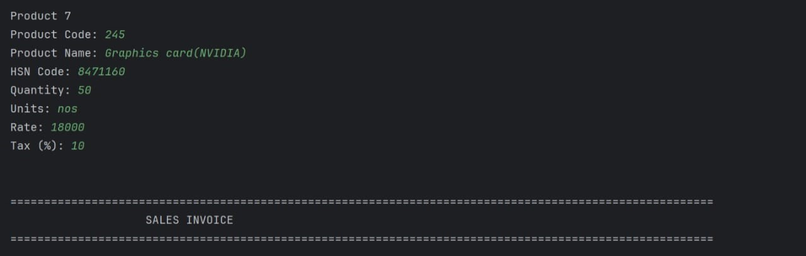
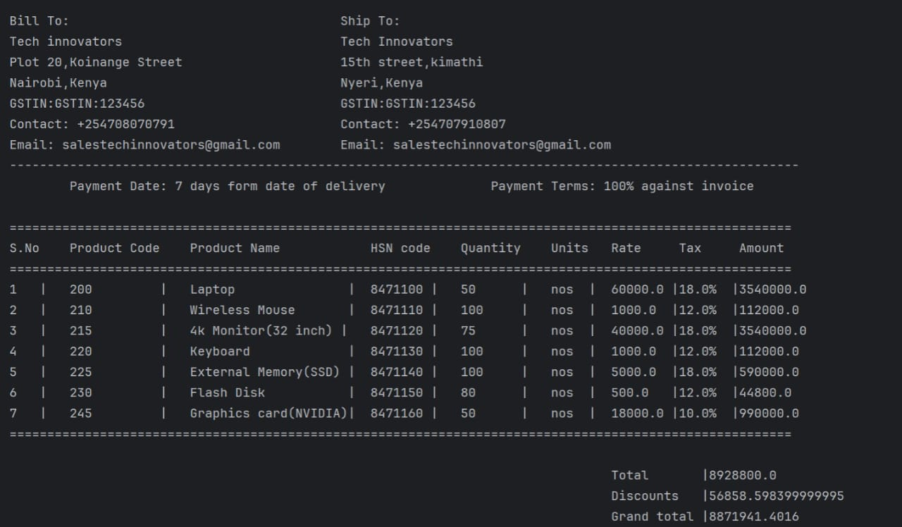
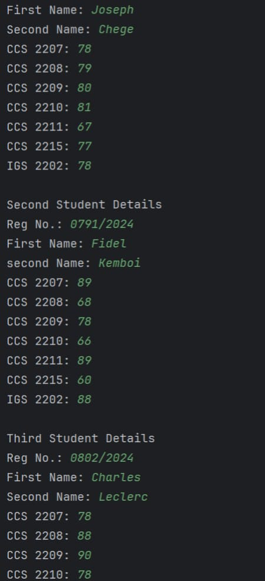
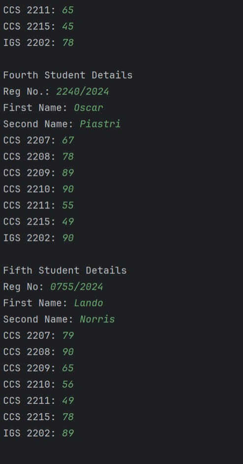
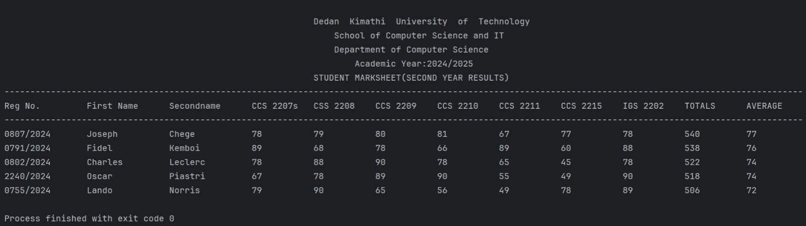

# Java Basics — Core Assignments

Here are my project output screenshots:

## 1. Invoice (Basic & Sales)

**Invoice Assignment 1**  

**Invoice Assignment 2 (Sales)**  
  
  
  
  

## 2. MarkSheet Program

  
  

---

### About

This repository contains Java source code and output screenshots for three fundamental assignments: basic invoice, sales invoice, and student marksheet — showcasing use of variables, input handling, calculations, formatting, and arrays/lists.

